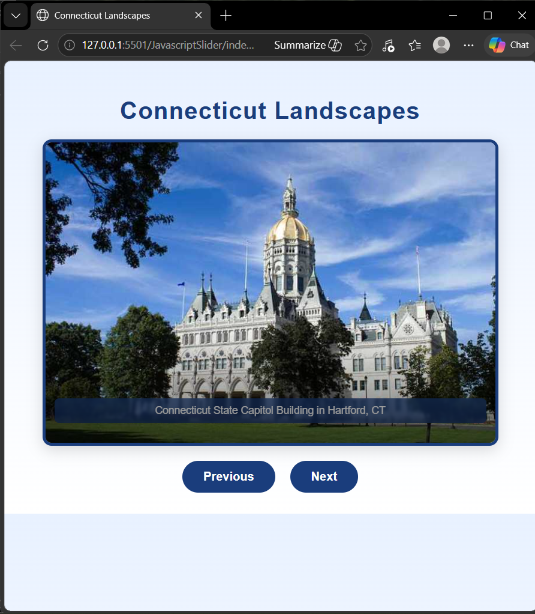

Connecticut LandScape Slider:

A responsive Javascript image slider showcasing a few landmarks across Connecticut.  Built with HTML, CSS and Vanilla Javascript.  No Libraries or frameworks.

Live Demo:

Screenshot:

Features:
- Smooth sliding transitions
- Infinite looping using cloned slides   
- Previous/Next navigation buttons
- Responsive Layout

How it works:
The slider uses:
- `translateX` to move slides horizontally
- Cloned first and Last slides to create a infinite loop
- An index counter to track the current slide

How to use:
- Clone the repo
- Open index.html in your browser
- Use Previous or Next button to cycle through the images

